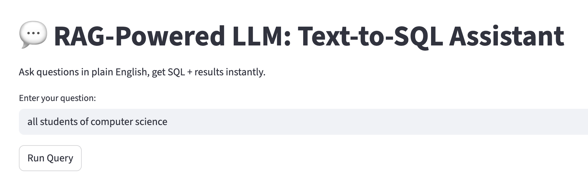
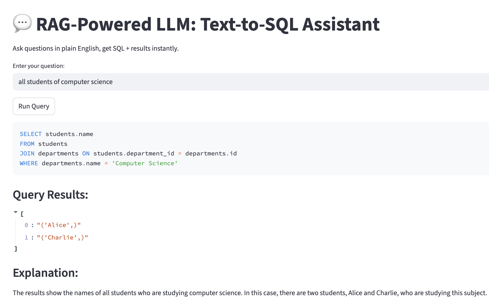

# 💬 NLP SQL Assistant  
  
  
  
  
  

A **RAG-powered LLM assistant** that converts natural language questions into SQL queries, executes them, and returns results with **human-friendly explanations**.  
Built with **LangChain**, **GPT-4**, and **Streamlit** to make analytics accessible to everyone.

---

## 📸 Demo

| Ask in English | See the SQL & Results |
|----------------|-----------------------|
|  |  |

---

## 🚀 Features
✅ **Natural Language → SQL Generation** using GPT-4  
✅ **Retrieval-Augmented Generation (RAG)** with Chroma for schema awareness  
✅ **Query Execution** on SQLite/PostgreSQL/MySQL databases  
✅ **Plain-English Result Explanation**  
✅ **Interactive Streamlit Web App**  

---

## 🛠️ Tech Stack

| Component  | Technology |
|------------|------------|
| **LLM** | OpenAI GPT-4 |
| **Orchestration** | LangChain |
| **Vector Store** | Chroma |
| **Frontend** | Streamlit |
| **Database** | SQLite (demo), works with others |
| **Language** | Python |

---

## 📂 Project Structure
nlp_sql_assistant
│── app.py # Streamlit app
│── create_db.py # Creates sample SQLite DB
│── university.db # Example database
│── requirements.txt # Dependencies
│── README.md # Project documentation
